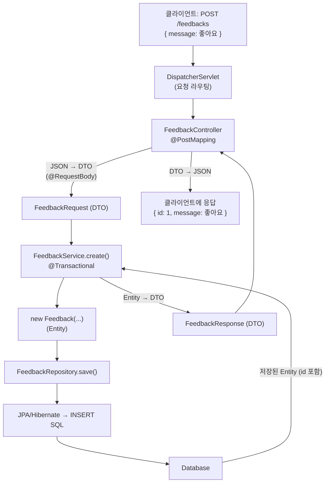

# 스프링 핵심 개념 + 요청 플로우

> 스프링(부트) 핵심 개념을 예시와 함께 정리하고, 컨트롤러·DTO·서비스 사이의 흐름을 끝까지 추적. 예시는 피드백 API 기준.

## 스프링 vs 스프링 부트

- **스프링**: 핵심 프레임워크 (DI 컨테이너 + 웹/데이터 등 모듈).
- **스프링 부트**: 스프링 위에 **자동 설정 + 내장 서버 + 스타터**를 얹어 설정을 없앤 것.

```
Spring (엔진)  ←  Spring Boot (시동·기어·계기판 붙인 완성차)
```

`main` 하나 실행했더니 톰캣이 8080으로 뜬 것 = 부트의 자동 설정 + 내장 서버 덕분.

## IoC와 DI (의존성 주입) — 가장 중요

- **DI**: 필요한 객체를 내가 `new` 로 만들지 않고, **스프링이 대신 넣어줌**.
- **IoC(제어의 역전)**: "객체를 만들고 연결하는 제어권"을 내가 아니라 스프링이 가짐.

```java
@RestController
public class FeedbackController {

    private final FeedbackService feedbackService;

    // new FeedbackService() 안 함. 파라미터로 받기만 함 → 스프링이 주입
    public FeedbackController(FeedbackService feedbackService) {
        this.feedbackService = feedbackService;
    }
}
```

**왜 좋은가**: 컨트롤러가 서비스를 "어떻게 만드는지" 몰라도 됨. 교체·테스트가 쉬워짐.

## Bean과 컨테이너

- **Bean**: 스프링이 관리하는 객체.
- **ApplicationContext(컨테이너)**: 빈들을 모아두고 필요할 때 주입해주는 상자.
- `@Service`, `@RestController`, `@Repository` 등이 붙으면 **자동으로 빈 등록** → `@ComponentScan` 이 스캔.

```java
@Service   // 이 순간 FeedbackService가 빈으로 등록됨
public class FeedbackService { }
```

## 주요 어노테이션

| 어노테이션 | 역할 |
|---|---|
| `@SpringBootApplication` | 시작점. 컴포넌트 스캔 + 자동 설정 켬 |
| `@RestController` | JSON 응답하는 컨트롤러 |
| `@Service` | 비즈니스 로직 계층 빈 |
| `@Repository` | DB 접근 계층 (JPA는 인터페이스에 자동) |
| `@Entity` | DB 테이블과 매핑되는 클래스 |
| `@GetMapping` `@PostMapping` | HTTP 메서드 + 주소 매핑 |
| `@RequestBody` | 요청 본문 JSON → 객체 |
| `@PathVariable` | URL 경로의 값(`/feedbacks/1`의 `1`)을 파라미터로 |
| `@RequestParam` | 쿼리 파라미터(`?key=value`)를 파라미터로 |
| `@Valid` | 입력 검증 켜기 |
| `@Transactional` | 트랜잭션 경계 |
| `@RestControllerAdvice` | 전역 예외 처리 |

## 계층 구조 (레이어드 아키텍처)

역할을 층으로 나눠서 관리. 각 층은 **아래 층만** 호출.

```
Controller  (요청 받고 응답)
    ↓
Service     (비즈니스 로직·판단·트랜잭션)
    ↓
Repository  (DB 접근)
    ↓
Database
```

- 규칙: **컨트롤러에 로직 X** (서비스 호출만), **서비스가 판단**, **레포는 저장/조회만**.

## DTO vs Entity

| | Entity | DTO |
|---|---|---|
| 뜻 | DB 테이블과 매핑되는 클래스 | 요청/응답으로 주고받는 데이터 |
| 어노테이션 | `@Entity` | 없음 (보통 `record`) |
| 노출 | 밖으로 직접 내보내지 않음 | 컨트롤러 입출력 |

```java
@Entity
public class Feedback {          // DB용
    @Id @GeneratedValue Long id;
    String message;
}

public record FeedbackRequest(String message) {}          // 입력용
public record FeedbackResponse(Long id, String message) {} // 출력용
```

**왜 나누나**: 엔티티를 그대로 노출하면 DB 구조가 API에 새어나가고, 원치 않는 필드까지 나갈 수 있음. DTO로 필요한 것만 주고받음.

## JPA와 Repository

- **JPA**: 자바 객체 ↔ DB 테이블을 자동 매핑. SQL 직접 안 써도 됨.
- **Repository**: 인터페이스만 선언하면 `save`·`findAll`·`findById` 등이 **자동 생성**.

```java
public interface FeedbackRepository extends JpaRepository<Feedback, Long> {
    // 이 한 줄로 CRUD 메서드가 다 생김
}
```

## 트랜잭션 (@Transactional)

여러 DB 작업을 **하나의 묶음**으로. 중간에 실패하면 전부 롤백(원상복구). **서비스 계층에 둠.**

```java
@Transactional
public FeedbackResponse create(String message) {
    Feedback saved = repository.save(new Feedback(message));
    return new FeedbackResponse(saved.getId(), saved.getMessage());
}

@Transactional(readOnly = true)  // 조회 전용 (살짝 최적화)
public List<FeedbackResponse> findAll() { ... }
```

## 검증 (@Valid)

잘못된 입력을 컨트롤러 진입 시점에 막음.

```java
public record FeedbackRequest(
        @NotBlank(message = "메시지는 비어 있을 수 없습니다") String message
) {}

@PostMapping
public FeedbackResponse create(@Valid @RequestBody FeedbackRequest req) { ... }
//                             ↑ 이게 있어야 @NotBlank가 동작
```

## 예외 처리 (@RestControllerAdvice)

컨트롤러마다 try-catch 하지 않고, **한 곳에서** 예외를 일관된 응답으로 변환.

```java
@RestControllerAdvice
public class GlobalExceptionHandler {

    @ExceptionHandler(MethodArgumentNotValidException.class)
    public ResponseEntity<String> handleValidation(MethodArgumentNotValidException e) {
        FieldError fieldError = e.getBindingResult().getFieldError();
        String msg = (fieldError != null) ? fieldError.getDefaultMessage() : "잘못된 요청";
        return ResponseEntity.status(HttpStatus.BAD_REQUEST).body(msg);
    }
}
```

---

# 요청 플로우: 컨트롤러 → DTO → 서비스 → DB

`POST /feedbacks` 요청 하나가 어떻게 흐르는지 끝까지 추적.

## 그림



## 단계별 설명

1. **요청 도착** — 클라이언트가 JSON 본문과 함께 `POST /feedbacks` 전송.
2. **라우팅** — 스프링의 DispatcherServlet이 주소·메서드를 보고 `FeedbackController.create()` 로 연결.
3. **JSON → DTO** — `@RequestBody` 가 JSON을 `FeedbackRequest` 객체로 변환 (Jackson 라이브러리).
4. **컨트롤러 → 서비스** — 컨트롤러는 로직 없이 `feedbackService.create(req.message())` 호출만.
5. **서비스 로직** — `@Transactional` 안에서 `Feedback` 엔티티를 만들고 `repository.save()`.
6. **레포 → DB** — JPA가 `save()` 를 `INSERT` SQL로 바꿔 DB에 저장. 저장되면 **id가 채워진 엔티티** 반환.
7. **엔티티 → DTO** — 서비스가 저장 결과를 `FeedbackResponse` 로 변환해서 반환 (엔티티를 직접 노출하지 않음).
8. **DTO → JSON** — 컨트롤러가 DTO를 반환하면 Jackson이 JSON으로 바꿔 응답.

## 각 조각이 하는 일 요약

| 조각 | 입력 | 출력 | 책임 |
|---|---|---|---|
| Controller | HTTP 요청 | HTTP 응답 | 받고 넘기고 응답 (로직 X) |
| Request DTO | JSON | 자바 객체 | 입력 데이터 담기 |
| Service | DTO 값 | Response DTO | 비즈니스 로직·트랜잭션 |
| Entity | — | — | DB 테이블 표현 |
| Repository | Entity | Entity/Optional | DB 저장·조회 |
| Response DTO | Entity 값 | JSON | 출력 데이터 담기 |

## 핵심 원칙 (면접·발표에서 나옴)

- **컨트롤러는 얇게**: 로직은 서비스로.
- **엔티티는 밖으로 안 내보냄**: 항상 DTO 경유.
- **트랜잭션은 서비스에**: DB 작업 묶음의 경계.
- **예외는 전역 핸들러로**: 컨트롤러마다 try-catch 금지.

→ 함께 보기: [자바 기본 개념 노트](java-01-basics.md)
